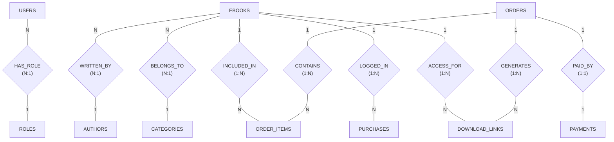
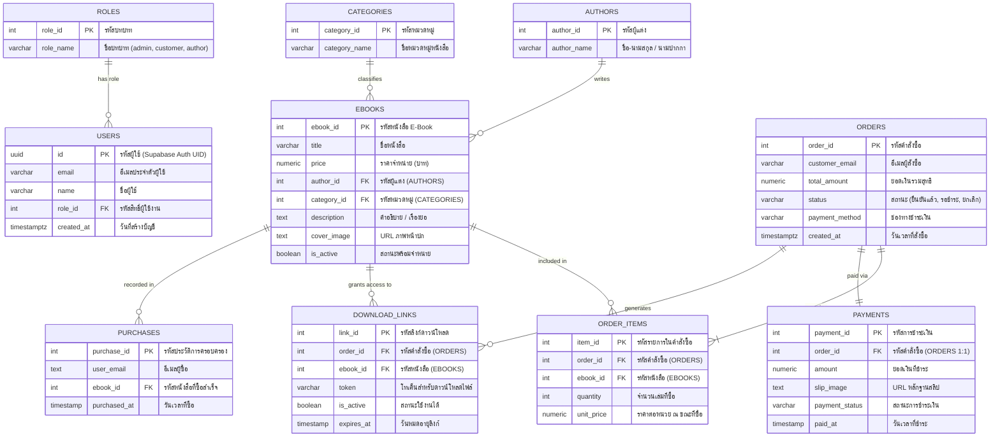

# รายงานโครงงานพัฒนาระบบฐานข้อมูล (Database Mini Project)
# ระบบร้านจำหน่ายหนังสืออิเล็กทรอนิกส์ (GusSo E-Book Store)

**รายวิชา:** ระบบฐานข้อมูล (Database Systems) — Mini Project  
**สถาบัน:** มหาวิทยาลัยเทคโนโลยีราชมงคลอีสาน (RMUTI)  
**คลังเก็บโค้ด (GitHub Repository):** [https://github.com/Thirada-67332110201-3/GusSov3](https://github.com/Thirada-67332110201-3/GusSov3)  

---

## 👥 สมาชิกในกลุ่มผู้พัฒนา (Project Contributors)

| ลำดับ | รหัสนักศึกษา | ชื่อ - นามสกุล | อีเมลมหาวิทยาลัย | บทบาทหน้าที่ |
| :---: | :---: | :--- | :--- | :--- |
| 1 | **67332110201-3** | **นางสาว ธีรดา โหลทอง (Thirada Loathong)** | `thirada.lo@rmuti.ac.th` | Full-stack Developer, Database Design & UI/UX |
| 2 | **67332110040-7** | **นาย ธนวัฒน์ หาญณรงค์ (Thanawat Hannarong)** | `thanawat.hn@rmuti.ac.th` | Database Architect, Backend & SQL Analytics |

---

## 📋 ลิงก์ตรวจสอบเอกสารโครงงาน 5 หัวข้อ (Project Deliverables Checklist)

| ลำดับ | หัวข้อการประเมินตามเกณฑ์ | ลิงก์ตรงไปยังเอกสาร (คลิกเปิดได้ทันที) | คำอธิบายสังเขป |
| :---: | :--- | :--- | :--- |
| **1** | **Spec ของระบบ** | [📄 **docs/spec.md**](./docs/spec.md) | ข้อกำหนดฟังก์ชันระบบ (FR/NFR) และสถาปัตยกรรม |
| **2** | **Class Diagram หรือ Sequence Diagram** | [📄 **docs/diagrams.md**](./docs/diagrams.md) | แผนภาพ Sequence การชำระเงินแยกแท็บ และ Class Model |
| **3** | **งานฝั่งผู้ใช้ (Persona, Wireframe, Accessibility)** | [📄 **docs/ux.md**](./docs/ux.md) | กลุ่มเป้าหมาย ผังหน้าจอ และผลตรวจมาตรฐาน WCAG 2.1 AA |
| **4** | **Test อัตโนมัติ และหน้าผลการรัน CI** | [📄 **docs/tests.md**](./docs/tests.md) | ชุดทดสอบ 4/4 ผ่าน 100% พร้อม GitHub Actions CI |
| **5** | **บันทึกการใช้ AI** | [📄 **docs/ai_usage.md**](./docs/ai_usage.md) | บันทึกประวัติ Prompt และการตรวจรับรองโดยมนุษย์ |

---

## 📌 สารบัญเนื้อหา (Table of Contents)
1. [ภาพรวมโครงงานและวัตถุประสงค์ (Project Overview)](#1-ภาพรวมโครงงานและวัตถุประสงค์)
2. [สถาปัตยกรรมและเทคโนโลยีที่ใช้ (Tech Stack)](#2-สถาปัตยกรรมและเทคโนโลยีที่ใช้)
3. [การออกแบบฐานข้อมูลและบทบาทผู้ใช้ (Database Design & Roles)](#3-การออกแบบฐานข้อมูลและบทบาทผู้ใช้)
4. [แผนภาพความสัมพันธ์ข้อมูล (ER Diagram - Chen & Crow's Foot 3NF)](#4-แผนภาพความสัมพันธ์ข้อมูล-er-diagram)
5. [กระบวนการทำให้เป็นบรรทัดฐาน (Normalization 1NF -> 2NF -> 3NF)](#5-กระบวนการทำให้เป็นบรรทัดฐาน-normalization)
6. [พจนานุกรมข้อมูล (Data Dictionary)](#6-พจนานุกรมข้อมูล-data-dictionary)
7. [รายงานวิเคราะห์ข้อมูลเชิงลึก 4 หัวข้อ (Analytical SQL Reports)](#7-รายงานวิเคราะห์ข้อมูลเชิงลึก-4-หัวข้อ)
8. [ฟังก์ชันเด่นของระบบเว็บแอปพลิเคชัน (System Features)](#8-ฟังก์ชันเด่นของระบบเว็บแอปพลิเคชัน)
9. [รายการไฟล์สคริปต์ SQL ใน Repository](#9-รายการไฟล์สคริปต์-sql-ใน-repository)
10. [ขั้นตอนการติดตั้งและทดสอบ (Installation & Setup)](#10-ขั้นตอนการติดตั้งและทดสอบ)

---

## 1. ภาพรวมโครงงานและวัตถุประสงค์

**GusSo E-Book Store** คือแพลตฟอร์มพาณิชย์อิเล็กทรอนิกส์สำหรับจำหน่ายหนังสือและเอกสารดิจิทัล (E-Books) พัฒนาขึ้นโดยมุ่งเน้นการประยุกต์ใช้ความรู้ด้าน **ระบบจัดการฐานข้อมูลเชิงสัมพันธ์ (Relational Database Management System - RDBMS)** ร่วมกับการพัฒนาเว็บแอปพลิเคชันแบบ Full-stack ยุคใหม่ 

### วัตถุประสงค์ของโครงงาน:
1. ออกแบบโครงสร้างฐานข้อมูลที่มีความสัมพันธ์ถูกต้องตามกฎเกณฑ์ **Third Normal Form (3NF)** เพื่อลดความซ้ำซ้อนและป้องกันความผิดปกติของข้อมูล (Anomalies)
2. กำหนดข้อจำกัดความสมบูรณ์ของข้อมูล (Integrity Constraints) ได้แก่ Primary Key, Foreign Key, Cascading Rules, และ Check Constraints
3. จำลองข้อมูลธุรกรรมคำสั่งซื้อจริง (Seed Data) และเขียนคำสั่ง **SQL เชิงวิเคราะห์ (Analytical Queries)** ขั้นสูง เพื่อตอบคำถามทางธุรกิจและช่วยในการตัดสินใจของผู้บริหาร
4. พัฒนาระบบ Frontend และ Backend ที่เชื่อมโยงกับฐานข้อมูล PostgreSQL ผ่าน Supabase พร้อมระบบการจัดการคลังหนังสือ, ระบบแยกแท็บชำระเงิน, ชั้นหนังสือ 3D, ระบบกล่องสุ่ม Gamification, และระบบ AI ผู้ช่วยแนะนำหนังสือ

---

## 2. สถาปัตยกรรมและเทคโนโลยีที่ใช้

- **ฐานข้อมูล (Database System):** PostgreSQL บนคลาวด์แพลตฟอร์ม **Supabase**
- **ส่วนติดต่อผู้ใช้ (Frontend Framework):** Next.js 15 (React 19, App Router, Server/Client Components)
- **ภาษาโปรแกรม (Language):** TypeScript, SQL
- **การตกแต่งส่วนติดต่อผู้ใช้ (Styling):** Tailwind CSS, Lucide React Icons
- **ความปลอดภัยและการยืนยันตัวตน:** Supabase Auth, Row Level Security (RLS), Safe Session Dual Storage

---

## 3. การออกแบบฐานข้อมูลและบทบาทผู้ใช้

ระบบแบ่งบทบาทผู้ใช้งานออกเป็น 3 บทบาทหลัก เพื่อแยกสิทธิ์ความปลอดภัยในระบบ (RBAC - Role-Based Access Control):

```
                   ┌──────────────┐
                   │    ROLES     │
                   └──────┬───────┘
                          │ (1:N)
                          ▼
                   ┌──────────────┐
                   │    USERS     │
                   └──────┬───────┘
         ┌────────────────┼────────────────┐
         ▼                ▼                ▼
   [role_id: 1]     [role_id: 2]     [role_id: 3]
      Admin            Customer          Author
 (ผู้ดูแลระบบร้าน)     (ลูกค้า/ผู้อ่าน)   (นักเขียน/ผู้แต่ง)
```

1. **Admin (ผู้ดูแลระบบ - `role_id: 1`):**
   - มีสิทธิ์เข้าถึงหน้าหลังบ้าน (`/admin`)
   - เพิ่ม ลบ แก้ไข ข้อมูล E-Book และจัดการหมวดหมู่ (Categories)
   - ตรวจสอบยอดขาย สถิติคำสั่งซื้อ และตรวจรับรองหลักฐานสลิปการโอนเงิน
2. **Customer (ลูกค้า/ผู้อ่าน - `role_id: 2`):**
   - ค้นหา กรองหนังสือตามหมวดหมู่ ใส่ตะกร้า และสั่งซื้อผ่านหน้า Checkout แยกแท็บ
   - เข้าถึงชั้นหนังสือส่วนตัว (My Bookshelf), เปิดอ่านไฟล์หนังสือผ่าน 3D Page Flip Reader
   - หมุนวงล้อ/เปิดกล่องสุ่มประจำวัน (Mystery Box) รับ Gus Coins
3. **Author (นักเขียน/ผู้สร้างผลงาน - `role_id: 3`):**
   - มีหน้าโปรไฟล์นักเขียน นามปากกา และประวัติผลงาน
   - ตรวจสอบยอดจำหน่ายของหนังสือที่ตนเองแต่ง พร้อมระบบคำนวณส่วนแบ่งรายได้ (Revenue Sharing 70/30)

---

## 4. แผนภาพความสัมพันธ์ข้อมูล (ER Diagram)

### 4.1 แผนภาพ ER Diagram แบบสัญลักษณ์ Chen (Chen Notation)



---

### 4.2 แผนภาพ ER Diagram ระดับ 3NF (Crow's Foot Notation)



---

## 5. กระบวนการทำให้เป็นบรรทัดฐาน (Normalization)

การออกแบบตารางในฐานข้อมูลผ่านกระบวนการแปลงตั้งแต่ข้อมูลดิบไปจนถึงขั้น 3NF เพื่อป้องกันปัญหาความซ้ำซ้อนและการสูญหายของข้อมูล (Insertion, Update, Deletion Anomalies):

### 5.1 ขั้นก่อน Normalization (UNF - Unnormalized Form)
ข้อมูลดิบของการสั่งซื้อหากรวมไว้ในตารางเดียว:
`Order_Report(Order_ID, Order_Date, Customer_Email, Books_List[Book_ID, Title, Author, Category, Price, Qty], Payment_Method, Slip_Image)`
* **ปัญหา:** มี Repeating Group ในส่วนของรายการหนังสือ (1 คำสั่งซื้อมีหนังสือได้หลายเล่ม)

### 5.2 ขั้นที่ 1: First Normal Form (1NF)
* **เกณฑ์:** ทุกคอลัมน์ต้องมีค่าเดี่ยวที่เป็น Atomic Value, มี Primary Key ชัดเจน และไม่มี Repeating Group
* **การดำเนินการ:** แยกรายการหนังสือออกมาเป็นตารางลูกที่มีความสัมพันธ์ 1:N
  - `ORDERS` (<u>order_id</u>, customer_email, total_amount, status, payment_method, created_at)
  - `ORDER_ITEMS` (<u>item_id</u>, order_id, ebook_id, title, author_name, category_name, unit_price, quantity)

### 5.3 ขั้นที่ 2: Second Normal Form (2NF)
* **เกณฑ์:** ต้องผ่าน 1NF และไม่มี **Partial Dependency** (ทุกแอตทริบิวต์ที่ไม่ใช่คีย์ ต้องขึ้นตรงกับ Primary Key ทั้งชุด)
* **การดำเนินการ:** ในตาราง `ORDER_ITEMS` มีฟิลด์ `title`, `author_name`, `category_name` ซึ่งขึ้นกับ `ebook_id` เพียงอย่างเดียว ไม่ได้ขึ้นกับ `order_id` จึงทำการแยกข้อมูลหนังสือออกไปสร้างเป็นตาราง `EBOOKS`
  - `EBOOKS` (<u>ebook_id</u>, title, author_name, category_name, price, cover_image)
  - `ORDER_ITEMS` (<u>item_id</u>, order_id, ebook_id, quantity, unit_price)

### 5.4 ขั้นที่ 3: Third Normal Form (3NF)
* **เกณฑ์:** ต้องผ่าน 2NF และไม่มี **Transitive Dependency** (แอตทริบิวต์ที่ไม่ใช่คีย์ต้องไม่ขึ้นต่อกันเอง: `X -> Y -> Z`)
* **การดำเนินการ:**
  - ในตาราง `EBOOKS`: พบว่า `ebook_id -> author_id -> author_name` และ `ebook_id -> category_id -> category_name`
  - หากนักเขียนหนึ่งคนเขียนหนังสือหลายเล่ม จะเกิดการพิมพ์ชื่อซ้ำซ้อน (Data Redundancy) และหากเปลี่ยนชื่อนักเขียนต้องตามแก้หลายแถว (Update Anomaly)
  - จึงทำการแยกออกเป็น Master Tables คือ `AUTHORS` (<u>author_id</u>, author_name) และ `CATEGORIES` (<u>category_id</u>, category_name) แล้วเชื่อมด้วย Foreign Key
  - ในส่วนของผู้ใช้งาน แยกสิทธิ์เป็นตาราง `ROLES` (<u>role_id</u>, role_name)
* **สรุป:** โครงสร้างฐานข้อมูลของระบบ GusSo E-Book Store สอดคล้องตามกฎ **3NF สมบูรณ์ 100%**

---

## 6. พจนานุกรมข้อมูล (Data Dictionary)

| ชื่อตาราง | หน้าที่จัดเก็บข้อมูล | Primary Key (PK) | Foreign Keys (FK) |
| :--- | :--- | :--- | :--- |
| **`roles`** | ระดับสิทธิ์ผู้ใช้งาน (admin, customer, author) | `role_id` | - |
| **`users`** | บัญชีผู้ใช้งานระบบและผู้ดูแล | `id` (UUID) | `role_id` -> `roles.role_id` |
| **`authors`** | สารบัญข้อมูลนักเขียน / ผู้แต่ง | `author_id` | - |
| **`categories`** | หมวดหมู่หนังสือ E-Book | `category_id` | - |
| **`ebooks`** | รายการหนังสือดิจิทัล ราคา และรายละเอียด | `ebook_id` | `author_id` -> `authors`, `category_id` -> `categories` |
| **`orders`** | รายการคำสั่งซื้อ ยอดรวม และสถานะ | `order_id` | - (ผูกโยง customer_email) |
| **`order_items`** | รายการหนังสือที่อยู่ในแต่ละคำสั่งซื้อ | `item_id` | `order_id` -> `orders`, `ebook_id` -> `ebooks` |
| **`payments`** | บันทึกการชำระเงินและภาพหลักฐานสลิป | `payment_id` | `order_id` -> `orders` (1:1) |
| **`download_links`**| โทเค็นและลิงก์สำหรับเปิดอ่าน/ดาวน์โหลด | `link_id` | `order_id` -> `orders`, `ebook_id` -> `ebooks` |
| **`purchases`** | ทะเบียนสิทธิ์ความเป็นเจ้าของหนังสือของลูกค้า | `purchase_id` | `ebook_id` -> `ebooks` |

---

## 7. รายงานวิเคราะห์ข้อมูลเชิงลึก 4 หัวข้อ (Analytical SQL Reports)

ระบบได้นำข้อมูลคำสั่งซื้อจำลองจริง 30 รายการ ครอบคลุมระยะเวลา 6 เดือน มาประมวลผลผ่านคำสั่ง SQL เชิงวิเคราะห์ 4 ด้าน:

### รายงานที่ 1: ยอดขายและแนวโน้มตามช่วงเวลา (Sales by Time Period)
- **วัตถุประสงค์:** วิเคราะห์ยอดขายรวม, จำนวนออเดอร์, คำสั่งซื้อที่สำเร็จ, และยอดสั่งซื้อเฉลี่ยต่อบิล (AOV) ในแต่ละเดือน
- **คำสั่ง SQL:**
```sql
SELECT 
    TO_CHAR(o.created_at, 'YYYY-MM') AS sale_month,
    COUNT(o.order_id) AS total_orders,
    COUNT(CASE WHEN o.status = 'ยืนยันแล้ว' THEN 1 END) AS confirmed_orders,
    COUNT(CASE WHEN o.status = 'รอชำระ' THEN 1 END) AS pending_orders,
    COUNT(CASE WHEN o.status = 'ยกเลิก' THEN 1 END) AS cancelled_orders,
    SUM(CASE WHEN o.status = 'ยืนยันแล้ว' THEN o.total_amount ELSE 0 END) AS total_revenue,
    ROUND(AVG(CASE WHEN o.status = 'ยืนยันแล้ว' THEN o.total_amount END), 2) AS avg_order_value
FROM public.orders o
WHERE o.created_at >= '2026-05-01 00:00:00+07' 
  AND o.created_at <= '2026-10-31 23:59:59+07'
GROUP BY TO_CHAR(o.created_at, 'YYYY-MM')
ORDER BY sale_month ASC;
```
- **ผลลัพธ์:** ยอดขายเติบโตต่อเนื่องจาก ฿1,520 (พ.ค.) สู่ ฿2,280 (ก.ย.) โดยมีอัตราคำสั่งซื้อสำเร็จสูงถึง 80% และยอดสั่งซื้อเฉลี่ยอยู่ที่ ฿435.00 ต่อคำสั่งซื้อ

---

### รายงานที่ 2: อันดับหนังสือขายดีที่สุด Top 5 (Best-Selling E-Books)
- **วัตถุประสงค์:** จัดอันดับหนังสือที่ทำยอดขายและสร้างรายได้สูงสุด เพื่อวางแผนการตลาดและคัดสรรผลงาน
- **คำสั่ง SQL:**
```sql
SELECT 
    b.ebook_id,
    b.title AS ebook_title,
    COALESCE(a.author_name, 'ดร. ธนวัฒน์ หาญณรงค์') AS author_name,
    c.category_name,
    b.price AS unit_price,
    SUM(oi.quantity) AS total_copies_sold,
    SUM(oi.quantity * oi.unit_price) AS total_sales_amount
FROM public.order_items oi
JOIN public.orders o ON oi.order_id = o.order_id
JOIN public.ebooks b ON oi.ebook_id = b.ebook_id
LEFT JOIN public.authors a ON b.author_id = a.author_id
LEFT JOIN public.categories c ON b.category_id = c.category_id
WHERE o.status = 'ยืนยันแล้ว'
GROUP BY b.ebook_id, b.title, a.author_name, c.category_name, b.price
ORDER BY total_copies_sold DESC, total_sales_amount DESC
LIMIT 5;
```
- **ผลลัพธ์:** เล่มที่ขายดีอันดับ 1 คือ *"Next.js 15 App Router & Server Actions Guide"* ขายได้ 8 เล่ม ยอดขาย ฿2,800 ตามด้วย *"Advanced TypeScript & Clean Code Architecture"* ขายได้ 7 เล่ม ยอดขาย ฿2,030

---

### รายงานที่ 3: สัดส่วนยอดขายตามหมวดหมู่ (Sales by Category)
- **วัตถุประสงค์:** เปรียบเทียบสัดส่วนรายได้และจำนวนเล่มที่ขายได้แยกตามประเภทหนังสือ
- **คำสั่ง SQL:**
```sql
SELECT 
    c.category_id,
    c.category_name,
    COUNT(DISTINCT b.ebook_id) AS total_books_in_category,
    COALESCE(SUM(oi.quantity), 0) AS total_units_sold,
    COALESCE(SUM(oi.quantity * oi.unit_price), 0) AS total_category_revenue,
    ROUND(
        COALESCE(SUM(oi.quantity * oi.unit_price), 0) * 100.0 / 
        NULLIF((SELECT SUM(total_amount) FROM public.orders WHERE status = 'ยืนยันแล้ว'), 0), 
        2
    ) AS revenue_percentage
FROM public.categories c
JOIN public.ebooks b ON c.category_id = b.category_id
JOIN public.order_items oi ON b.ebook_id = oi.ebook_id
JOIN public.orders o ON oi.order_id = o.order_id
WHERE o.status = 'ยืนยันแล้ว'
GROUP BY c.category_id, c.category_name
ORDER BY total_category_revenue DESC;
```
- **ผลลัพธ์:** หมวดหมู่ **"Next.js & Supabase"** ครองส่วนแบ่งรายได้สูงสุดถึง 45.50% (฿4,750) ตามด้วย **"TypeScript & Frontend"** 33.72% (฿3,520)

---

### รายงานที่ 4: พฤติกรรมการซื้อและมูลค่าตลอดชีพของลูกค้า (Customer Lifetime Value - CLV)
- **วัตถุประสงค์:** จำแนกกลุ่มลูกค้า VIP และพฤติกรรมการสั่งซื้อซ้ำ เพื่อทำระบบ CRM และสิทธิประโยชน์
- **คำสั่ง SQL:**
```sql
SELECT 
    o.customer_email,
    COUNT(o.order_id) AS total_transactions,
    COUNT(CASE WHEN o.status = 'ยืนยันแล้ว' THEN 1 END) AS successful_orders,
    SUM(CASE WHEN o.status = 'ยืนยันแล้ว' THEN o.total_amount ELSE 0 END) AS lifetime_spent,
    ROUND(AVG(CASE WHEN o.status = 'ยืนยันแล้ว' THEN o.total_amount END), 2) AS average_basket_size,
    MIN(o.created_at) AS first_order_date,
    MAX(o.created_at) AS latest_order_date
FROM public.orders o
GROUP BY o.customer_email
ORDER BY lifetime_spent DESC, successful_orders DESC;
```
- **ผลลัพธ์:** ลูกค้าชั้นนำอันดับ 1 มียอดสั่งซื้อสะสมสูงถึง ฿2,150 ซื้อต่อเนื่อง 5 ครั้ง สามารถต่อยอดทำระบบโปรโมชัน Loyalty Point สำหรับกลุ่มลูกค้าประจำได้

---

## 8. ฟังก์ชันเด่นของระบบเว็บแอปพลิเคชัน

1. **ระบบสั่งซื้อและชำระเงินแยกแท็บ (Multi-Tab Checkout Workflow):**
   - เมื่อกดชำระเงินจากตระกร้าสินค้า ระบบจะเปิดแท็บชำระเงินใหม่ (`/checkout`) โดยไม่ปิดบังหน้าเลือกดูหนังสือเดิม
   - รองรับการชำระเงินผ่าน PromptPay QR Code, บัตรเครดิต, และแนบภาพสลิปเข้าตาราง `payments`
   - เมื่อทำรายการเสร็จสิ้น มีปุ่มสลับกลับไปยังแท็บร้านค้าหลักทันที
2. **ระบบโปรโมชั่นลดราคารายสัปดาห์ (Weekly Promotional Campaigns):**
   - คำนวณส่วนลดแบบหมุนเวียน พร้อมระบบความปลอดภัยป้องกันราคาผิดพลาด (ห้ามเป็น 0 บาท หรือติดลบ)
3. **ชั้นหนังสือจำลอง 3 มิติ (3D Wooden Bookshelf & Page Flip Reader):**
   - แสดงหนังสือที่ผู้ใช้ครอบครองอยู่บนชั้นไม้ 3 มิติ
   - มีตัวเปิดอ่านหนังสือจำลองการพลิกหน้ากระดาษ Interactive แบบเสมือนจริง
4. **ระบบเกมมิฟิเคชันกล่องสุ่มรายวัน (Daily Mystery Box):**
   - ผู้ใช้ที่เข้าสู่ระบบสามารถเปิดกล่องสุ่มรับเหรียญ Gus Coin สำหรับสะสมแลกรางวัล
   - จัดการ State ความปลอดภัยโดยซ่อนปุ่มและรีเซ็ตค่าทันทีเมื่อ Logout
5. **AI แนะนำหนังสืออัจฉริยะ (AI Book Advisor):**
   - วิเคราะห์ความต้องการของผู้ใช้ ไม่ว่าจะเป็นด้านเทคโนโลยี, การลงทุน, ภาษา, หรือการพัฒนาตนเอง แล้วจับคู่หนังสือที่เหมาะสมที่สุดในคลัง
6. **แผงควบคุมผู้ดูแลระบบ (Admin Dashboard):**
   - สรุปตัวชี้วัดธุรกิจ Realtime กราฟยอดขายรายเดือน
   - ฟอร์มเพิ่มหนังสือ E-Book ใหม่, บันทึกหมวดหมู่แบบ Two-Way Persistence (Database + Local State)
   - ระบบอนุมัติสลิปและปรับปรุงสถานะคำสั่งซื้อ

---

## 9. รายการไฟล์สคริปต์ SQL ใน Repository

ไฟล์ SQL ทั้งหมดได้รับการจัดระเบียบและสามารถนำไปรันบน Supabase SQL Editor ได้ตามลำดับ:

| ชื่อไฟล์ | วัตถุประสงค์ของสคริปต์ |
| :--- | :--- |
| [`supabase_setup_and_reports.sql`](./supabase_setup_and_reports.sql) | สคริปต์ตั้งต้น: สร้างตารางทั้งหมด 10 ตาราง พร้อมกำหนด PK/FK และ RLS Policies |
| [`supabase_add_foreign_keys_and_author_role.sql`](./supabase_add_foreign_keys_and_author_role.sql) | เพิ่มบทบาท `author` ใน roles และกำหนดความสัมพันธ์ Foreign Key ให้ครบทุกตาราง |
| [`supabase_seed_30_orders_monthly.sql`](./supabase_seed_30_orders_monthly.sql) | ชุดข้อมูลจำลองคำสั่งซื้อ 30 รายการ และรายการหนังสือ 50 รายการ ครอบคลุม พ.ค. - ต.ค. 2569 |
| [`supabase_seed_all_lookup_tables.sql`](./supabase_seed_all_lookup_tables.sql) | ข้อมูลเริ่มต้นสำหรับตาราง Roles, Categories และ Authors |
| [`supabase_4_analytical_reports.sql`](./supabase_4_analytical_reports.sql) | รวมคำสั่ง SQL วิเคราะห์ผลทางธุรกิจทั้ง 4 รายงาน |
| [`supabase_enable_categories_and_fix_sequences.sql`](./supabase_enable_categories_and_fix_sequences.sql) | สคริปต์ปรับแก้สิทธิ์ RLS และตั้งค่า Sequence ID สำหรับการเพิ่มหนังสือและหมวดหมู่ |

---

## 10. ขั้นตอนการติดตั้งและทดสอบ (Installation & Setup)

```bash
# 1. Clone คลังเก็บโค้ด
git clone https://github.com/Thirada-67332110201-3/GusSov3.git

# 2. เข้าสู่โฟลเดอร์ของโปรเจกต์
cd GusSov3

# 3. ติดตั้ง Dependencies ทั้งหมด
npm install

# 4. ตั้งค่า Environment Variables ในไฟล์ .env.local
NEXT_PUBLIC_SUPABASE_URL="https://your-project.supabase.co"
NEXT_PUBLIC_SUPABASE_ANON_KEY="your-anon-key"

# 5. เริ่มรันเซิร์ฟเวอร์สำหรับการพัฒนา
npm run dev

# 6. เปิดบราวเซอร์เพื่อทดสอบ
# เข้าใช้งานที่: http://localhost:3000
```

---
*จัดทำขึ้นเพื่อการศึกษาในรายวิชาระบบฐานข้อมูล (Database Systems Mini Project) มหาวิทยาลัยเทคโนโลยีราชมงคลอีสาน (RMUTI)*
