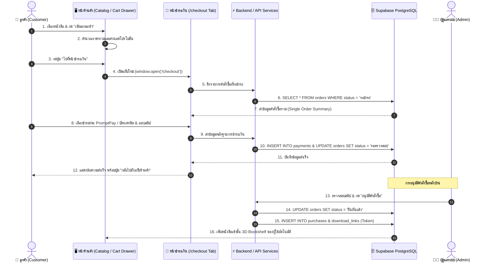
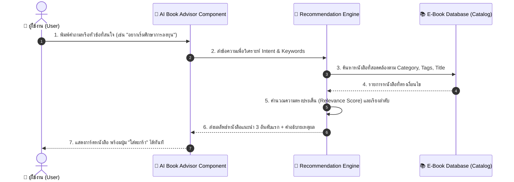
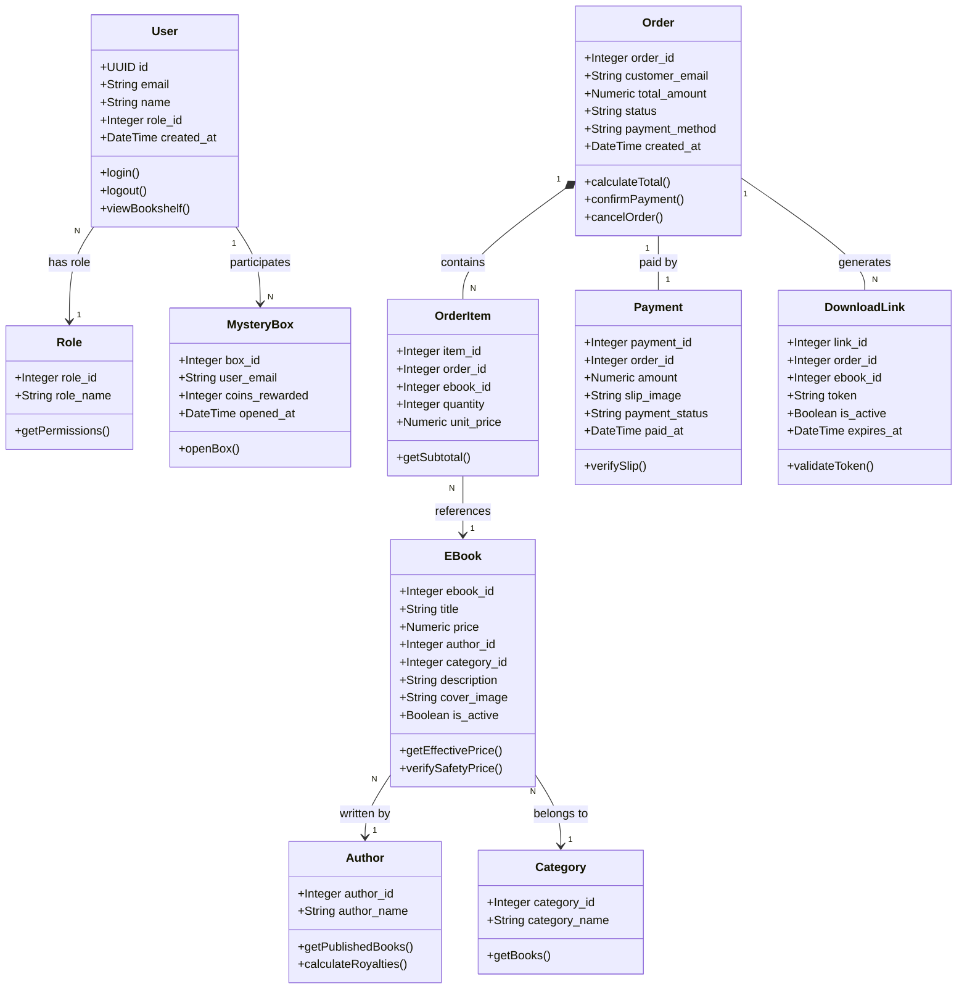

# แผนภาพสถาปัตยกรรมระบบ (System Diagrams)
## GusSo E-Book Store (ระบบร้านจำหน่ายหนังสืออิเล็กทรอนิกส์)

**เอกสาร:** Class Diagram & Sequence Diagram  
**มาตรฐานที่ใช้:** Unified Modeling Language (UML) & Mermaid  

---

## 1. ลำดับการทำงานของระบบ (Sequence Diagrams)

### 1.1 Sequence Diagram: ขั้นตอนการสั่งซื้อและชำระเงินแบบแยกแท็บ (Multi-Tab Checkout Sequence)

---

### 1.2 Sequence Diagram: ระบบ AI ผู้ช่วยแนะนำหนังสือ (AI Book Advisor Flow)

---

## 2. แผนภาพคลาสและโมเดลข้อมูล (Class Diagram / Domain Model)

